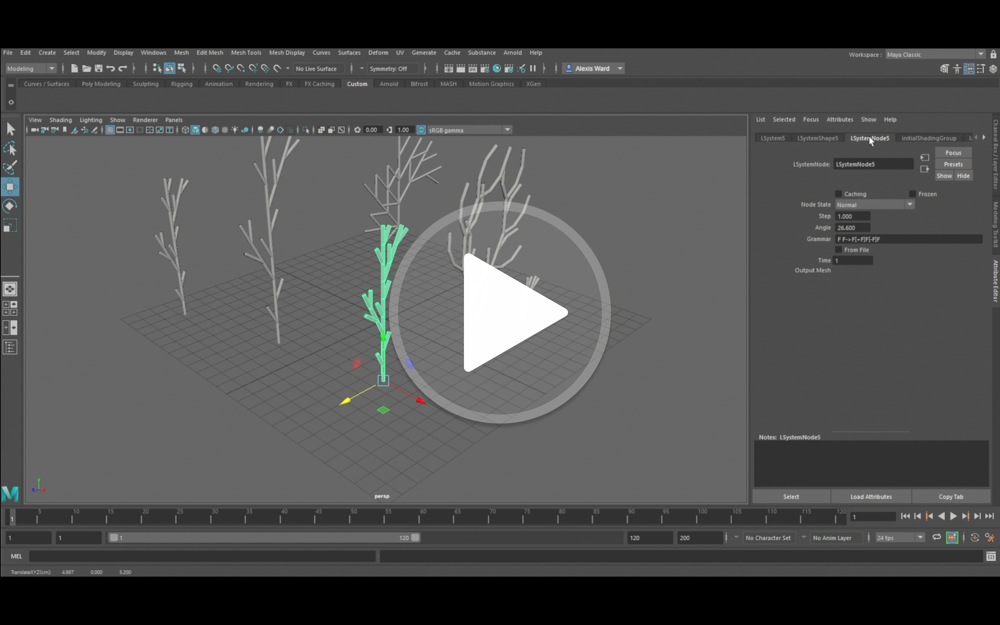

# Developing Maya Plug-ins Using MEL and C++

#### *Alexis Ward*

Built in **Microsoft Visual Studio 2015** for **Maya 2019**

## Demo Video

## The Assignment

I've completed all questions/parts of the assignment, and some optional or bonus features:

**The GUI popup:** Added a menu option (under *Create* - *Open LSystem Dialog*) to reopen the popup as needed, a ScrollField widget that loads the text data from a grammar file and allows the user to edit it, and a *Clear* button to erase all node structures dependent on the plug-in, in order to unload the plug-in with more ease.

**The Basic LSystem:** I went back and incorporated *CylinderMesh* geometry and node structures for this one as well. Each has a parent transform node and a mesh node which then connects its output shape to *initialShadingGroup*. They follow the same naming conventions outlined for the Dynamic LSystem to keep things consistent. The names for all nodes are unique and the plugin can easily load multiple LSystems (of each type) into the scene.

**The Dynamic LSystem:** Due to the format of the initial GUI, where the grammar input is not strictly from a file, the *Grammar* attribute shows the actual grammar text by default. In order to load from a filename, you can click the *From File* checkbox and then type the name of any file located in the "plants" folder from the project directory. I also removed the connection to *time1* so the iterations are solely from user input. 

Aside from the first option being run through a command and the second being created through the MEL script, the two LSystems differ in their node connections as follows:

**LSystem Node Connections:** LSystem# (transform), LSystemShape# (mesh) &rarr; initialShadingGroup

**Dynamic LSystem Node Connections:** LSystem# (transform), LSystemShape# (mesh) &rarr; LSystemNode# (custom) &rarr; initialShadingGroup

## Visual Studio Project Properties

Build the solution to create the .mll file. It should work regardless of which is the startup project, but here are the important property settings below. Make sure the solution platform is set to x64. Adjust to whichever Maya version you desire.

For example, this was built with *[MayaInstallDir Path] = C:\Program Files\Autodesk\Maya2019*

#### LSystem

**C/C++ &rarr; *General &rarr; Additional Include Directories:*** .;[MayaInstallDir Path]\include;%(AdditionalIncludeDirectories)

**C/C++ &rarr; *Preprocessor &rarr; Preprocessor Definitions:*** WIN32;NDEBUG;_CONSOLE;NT_PLUGIN;%(PreprocessorDefinitions)

**C/C++ &rarr; *Code Generation &rarr; Runtime Library:*** Multi-threaded DLL (/MD)

**Linker &rarr; *General &rarr; Additional Library Directories:*** .;[MayaInstallDir Path]\lib;%(AdditionalLibraryDirectories)

**Linker &rarr; *Input &rarr; Additional Dependencies:*** Foundation.lib;OpenMaya.lib;%(AdditionalDependencies)

#### LSystemMaya

**General &rarr; *Target Extension:*** .mll

**General &rarr; *Configuration Type:*** Dynamic Library (.dll)

**C/C++ &rarr; *General &rarr; Additional Include Directories:*** .;[MayaInstallDir Path]\include;%(AdditionalIncludeDirectories)

**C/C++ &rarr; *Preprocessor &rarr; Preprocessor Definitions:*** DIRMACRO=R"($(ProjectDir))";NDEBUG;WIN32;_WINDOWS;NT_PLUGIN;REQUIRE_IOSTREAM;%(PreprocessorDefinitions)

*(Note: DIRMACRO makes it easier to access the project folder's path; which is used to access the external MEL script and the "plants" folder. )*

**C/C++ &rarr; *Code Generation &rarr; Runtime Library:*** Multi-threaded DLL (/MD)

**Linker &rarr; *General &rarr; Output File:*** I save the file, <u>LSystem.mll</u>, to my devkit plug-in folder. Change this to wherever you like.

**Linker &rarr; *General &rarr; Additional Library Directories:*** [MayaInstallDir Path]\lib;%(AdditionalLibraryDirectories)

**Linker &rarr; *Input &rarr; Additional Dependencies:*** odbc32.lib;odbccp32.lib;OpenMaya.lib;OpenMayaRender.lib;Foundation.lib;OpenMayaUI.lib;OpenMayaAnim.lib;OpenMayaFX.lib;Image.lib;opengl32.lib;%(AdditionalDependencies)